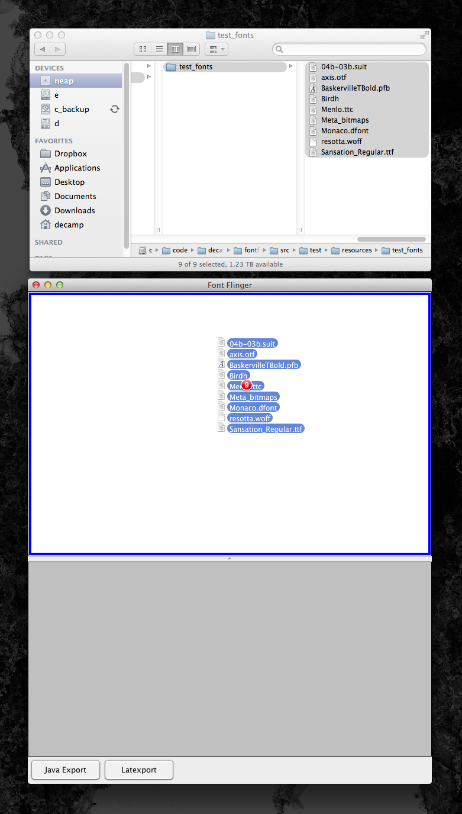

## WARNING

FontFlinger works best with an Apple JVM. After installing Java 8 from Oracle, I've discovered that 
non-apple Java distributions handle font parsing much differently, and throw expections if the 
font name is not encoded correctly. I plan to eventually integrate a font renaming utility, like TTX, 
but for now, FontFlinger will have limited functionality with newer JREs.

### FontFlinger:

Application for font conversion (OS X only). FontFlinger is mostly glue code that connects other utilities,
including Ghostscript, Fondu and various Latex utilities. FontFlinger can convert many common
font files to a format that can be used in Java, LaTex, or other.

Current version supports:
- FFIL
- LWFN
- OTC
- PFA
- PFB
- TFIL
- TTC
- TTF
- WOFF

Does not work with:
- bitmap fonts
- ???

Use:

Open aff and drag font files from finder onto top pane.

Files that were converted successfully will appear in the list. They can then be exported to a Java or 
Latex project. (If you just want the converted files, export to java without generated source code).

#### "Export Java"

Compile and run example:
> cd <java_example>
> javac FontExample.java
> java FontExample

Output:

#### "Export LaTex"
You'll need to specify how the input fonts will be used in a typeface.

The generated directory structure:

The resulting typeset document:

### Building:

A prebuilt version of the app is included: [target/FontFlinger.dmg]("target/FontFlinger.dmg").

Building the Java code and creating the app bundle can be done with:

$ ant

Compiling everything, including all the sundry utilities and C code, has not been documented 
or even automated.

### Third-Party Libraries:

Check the LICENSE.txt file for license information. FontFlinger does not compile against any third-party libraries, but
it does call several command-line utilities, some of which are included here in source, and some as binaries. All
software included is free and open sourced.

"thirdparty/fondu" is the "Fondu" source code, included because it required modification to run correctly in OS X 11.

"src/main/bin/fondu" is the precompiled fondu binary.

"thirdparty/ttc2ttf" is the soruce code for the "ttc2ttf" utility, included because it was difficult to locate and
I never found a precompiled version.

"src/main/bin/ttc2ttf" is the precompiled ttc2ttf binary.

"src/main/bin/gs_partial" is a precompiled, minimal version of Ghostscript. Ghostscript is very large and easy to
find, and so was not included in the repo.

"src/main/bin/pf2afm.ps" is a conversion utility distributed with Ghostscript.

The following binaries are all distributed with latex2e as free software. Most people with latex installed on their
computer will have these files in their "texbin" directory.
- "src/main/bin/afm2tfm"
- "src/main/bin/cfftot1"
- "src/main/bin/otftotfm"
- "src/main/bin/pltotf"
- "src/main/bin/t1dotlessj"
- "src/main/bin/t1unmac"
- "src/main/bin/ttf2tfm"
- "src/main/bin/vptovf"

---
Author: Philip DeCamp
